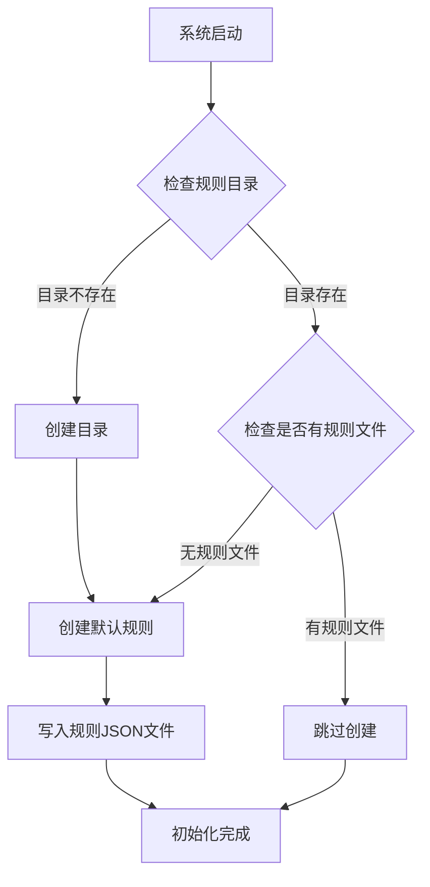

# Design Document: Default Delete Rules

## Overview

本设计文档描述了 VERTEX 系统在首次安装时自动创建默认删种规则的功能实现。该功能通过在系统初始化时检测规则目录状态，自动创建一组预定义的删种规则，为用户提供开箱即用的体验。

## Architecture

### 系统架构



### 初始化流程

1. 系统启动时调用初始化函数
2. 检查 `app/data/rule/delete/` 目录是否存在
3. 如果目录不存在，创建目录
4. 检查目录中是否已有 `.json` 文件
5. 如果没有规则文件，创建默认规则
6. 每个规则生成唯一 ID 并写入独立的 JSON 文件

## Components and Interfaces

### 1. DefaultDeleteRules 模块

新增模块 `app/libs/defaultDeleteRules.js`，负责默认规则的定义和初始化。

```javascript
// 接口定义
module.exports = {
  /**
   * 初始化默认删种规则
   * 如果规则目录为空，则创建默认规则
   * @returns {boolean} 是否创建了默认规则
   */
  initDefaultRules: function() {},
  
  /**
   * 获取默认规则定义列表
   * @returns {Array<DeleteRuleDefinition>} 默认规则定义数组
   */
  getDefaultRuleDefinitions: function() {}
};
```

### 2. 与现有系统的集成

- 在 `app/app.js` 启动时调用 `initDefaultRules()`
- 复用 `app/libs/util.js` 中的 UUID 生成函数
- 规则存储格式与 `DeleteRuleMod` 完全兼容

## Data Models

### DeleteRule 数据结构

```javascript
{
  "id": "a1b2c3d4",           // 8位UUID，自动生成
  "alias": "规则别名",         // 中文描述性名称
  "type": "normal",           // 规则类型：normal | javascript
  "priority": 0,              // 优先级，数值越大越先执行
  "fitTime": 300,             // 持续时间（秒），防止误删
  "deleteNum": 1,             // 单次删除数量
  "pause": false,             // 是否暂停而非删除
  "onlyDeleteTorrent": false, // 是否仅删除种子不删文件
  "limitSpeed": "",           // 限速值（字节/秒）
  "conditions": [             // 条件数组
    {
      "key": "trackerStatus", // 条件键
      "compareType": "contain", // 比较类型
      "value": "unregistered"   // 比较值
    }
  ]
}
```

### 默认规则定义

| 规则名称 | 条件 | fitTime | 优先级 |
|---------|------|---------|--------|
| Tracker错误删种 | trackerStatus 包含 "unregistered" 或 "not registered" | 600秒 | 10 |
| 卡住下载删种 | state 等于 "stalledDL" 且 addedTime 大于 86400 | 1800秒 | 5 |
| 高分享率删种 | ratio 大于 2 且 completedTime 大于 259200 | 3600秒 | 0 |
| 磁盘空间不足删种 | freeSpace 小于 10737418240 (10GB) | 300秒 | 20 |
| 无上传速度删种 | uploadSpeed 等于 0 且 completedTime 大于 604800 | 7200秒 | 0 |
| 做种时间超限删种 | completedTime 大于 2592000 (30天) | 3600秒 | 0 |

## Correctness Properties

*A property is a characteristic or behavior that should hold true across all valid executions of a system-essentially, a formal statement about what the system should do. Properties serve as the bridge between human-readable specifications and machine-verifiable correctness guarantees.*

### Property 1: Idempotent Initialization
*For any* rule directory state, calling initDefaultRules multiple times SHALL produce the same result as calling it once - if rules exist, no new rules are created; if no rules exist, default rules are created exactly once.
**Validates: Requirements 1.4, 5.1, 5.2**

### Property 2: Rule Format Consistency
*For any* default rule created by the system, the rule SHALL be stored as a valid JSON file with a unique 8-character hex ID, and the JSON structure SHALL match the schema expected by DeleteRuleMod.
**Validates: Requirements 1.2, 1.3, 4.1**

### Property 3: Rule Structure Validity
*For any* default rule created by the system, the rule SHALL have: a numeric priority field, a positive fitTime value greater than 0, a non-empty Chinese alias string, and type set to "normal".
**Validates: Requirements 3.1, 3.2, 3.3, 3.4**

### Property 4: Directory Creation
*For any* system initialization where the rule directory does not exist, the system SHALL create the directory and populate it with the complete set of default rules.
**Validates: Requirements 1.1, 5.3**

## Error Handling

### 错误场景处理

1. **目录创建失败**
   - 记录错误日志
   - 不阻塞系统启动
   - 返回 false 表示初始化失败

2. **文件写入失败**
   - 记录具体规则的错误信息
   - 继续尝试创建其他规则
   - 返回部分成功状态

3. **权限问题**
   - 检查目录写入权限
   - 提供明确的错误提示

```javascript
try {
  // 创建规则
} catch (error) {
  logger.error('Failed to create default delete rule:', error);
  // 继续执行，不阻塞启动
}
```

## Testing Strategy

### 测试框架

使用 Jest 作为测试框架，配合 fast-check 进行属性测试。

### 单元测试

1. **initDefaultRules 函数测试**
   - 空目录时创建规则
   - 非空目录时跳过创建
   - 目录不存在时创建目录

2. **规则格式验证测试**
   - ID 格式正确性
   - JSON 结构完整性
   - 必填字段存在性

### 属性测试

每个属性测试配置运行 100 次迭代。

1. **Property 1 测试**: 生成随机的目录状态（空/非空），验证幂等性
2. **Property 2 测试**: 验证所有生成的规则符合格式要求
3. **Property 3 测试**: 验证所有规则的结构字段有效性
4. **Property 4 测试**: 验证目录创建和规则填充行为

### 测试标注格式

```javascript
/**
 * **Feature: default-delete-rules, Property 1: Idempotent Initialization**
 * **Validates: Requirements 1.4, 5.1, 5.2**
 */
```

